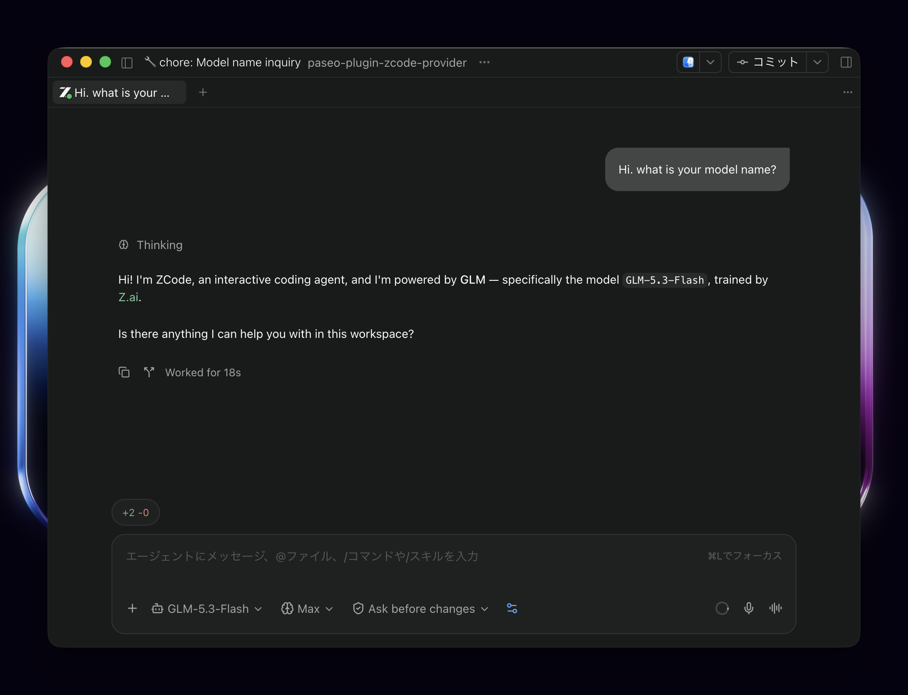

# ZCode Provider for Paseo

Use ZCode models, tools, and conversation history in [Paseo](https://github.com/getpaseo/paseo). This plugin connects to your installed ZCode app and uses the authentication and models you have configured there.



> [!NOTE]
> This plugin is under development and requires Paseo **0.8.0 or later**. Verification on 0.8.0 covers automated SDK/compiler/adapter tests, including provider replacement and session restoration, plus actual ZCode host initialization and model listing on macOS arm64. Real-model submission and UI restoration have not been reverified on 0.8.0.
>
> Earlier 0.8.0-beta.1 checks covered actual prompt responses, plan approval, and restoration across separate processes; UI checks used an isolated daemon with the provider registered as `codex`. Actual tool execution and restoration after restarting the Paseo app remain unverified. The screenshot above was supplied by the author. See the [verification notes](docs/verification.md) for details.

> [!IMPORTANT]
> This project is an unofficial tool and is not officially released, endorsed, or maintained by ZCode or Z.ai.

> [!WARNING]
> This plugin uses ZCode's undocumented headless mode. It does not modify the ZCode application itself or include any implementation that bypasses its communications. However, there is no guarantee that it will not be interpreted as violating the [Terms of Service](https://zcode.z.ai/en/terms). Therefore, please use it at your own risk.

## Features

- **Model and mode selection** — Model discovery, thinking settings, and `build` / `edit` / `yolo` editing modes with an independent plan toggle.
- **Conversations and tools** — Text and image prompts, slash commands, streaming responses, and tool execution status.
- **Approvals and questions** — Tool permissions, structured questions, plan approval and rejection, and generation interruption.
- **Persistence and restoration** — Conversation lists per workspace, importing existing ZCode conversations, and history restoration.
- **Session configuration** — MCP server configuration and notifications for token, cost, and context usage.
- **Diagnostics screen** — A read-only screen under **Settings → Plugins → zcode-provider** shows the detected installation path, versions, compatibility, verified-release fingerprint, session mapping location, and an on-demand host check.

The ZCode host manages credentials, model settings, and conversation storage. This repository does not bundle ZCode or credentials.

## Requirements

These requirements apply to the **machine running the Paseo daemon**.

| Component          | Supported configuration                                   |
| ------------------ | --------------------------------------------------------- |
| OS / CPU           | macOS arm64/x64, Linux arm64/x64, Windows x64             |
| ZCode              | **3.11.2 or later**, with bundled CLI **0.16.5 or later** |
| ZCode installation | Official installation; default paths below                |
| Node.js            | **22.12.0 or later**                                      |
| Paseo              | **0.8.0 or later**                                        |

Default installation paths are `/Applications/ZCode.app` on macOS, `/opt/ZCode` on Linux, and `%LOCALAPPDATA%\Programs\ZCode` on Windows. For a nonstandard location, set `PASEO_ZCODE_INSTALL` to its absolute path in the Paseo daemon environment. Specify the installation directory, not `zcode.cjs`. On Windows, the default requires `LOCALAPPDATA` to be a nonempty absolute path in that same environment; otherwise set `PASEO_ZCODE_INSTALL` explicitly. Installations under Program Files also require explicit configuration. An invalid explicit path fails instead of reverting to the default. The installed bundle's OS and CPU must match the daemon process; emulation does not bypass this check.

All three OS layouts are implemented and covered by automated tests. Actual ZCode host initialization and model listing have been verified on macOS arm64 only; Linux, Windows, and macOS x64 runtime checks remain unperformed.

Set up authentication and your models in ZCode first. The minimum versions apply to stable releases only. Newer stable releases, including major updates, are allowed; prereleases, missing or invalid versions, and versions below the minimum are rejected. The last verified installation is **ZCode 3.11.2 / CLI 0.16.5 on macOS arm64**. Allowing a newer version does not mean it has been verified.

The plugin discovers the installed host's RPC module through its static imports and required class/method structure. Changed file hashes, chunk names, or shortened export names alone do not reject startup. The official installation, OS/CPU, required files, and RPC structure must still be valid. Responses and events are checked during use: an incompatible update may fail at startup or only when a particular operation runs. Changes in meaning that preserve the data format may not be detected.

## Installation

Run these commands on the **machine running the Paseo daemon**.

1. Turn on **Settings → Plugins → Enable plugins** in Paseo for that daemon.
2. Install the plugin from GitHub:

   ```bash
   paseo plugin add supermomonga/paseo-plugin-zcode-provider
   ```

3. Confirm that `zcode-provider` is `running`:

   ```bash
   paseo plugin ls
   ```

Paseo downloads and compiles the plugin automatically; no manual clone, dependency installation, or build is needed. See the [official installation guide](https://github.com/getpaseo/paseo/blob/main/public-docs/plugins/v0.8/index.md#install-a-published-plugin) for more options.

> [!NOTE]
> Plugins run with the daemon user's permissions. Make sure you trust the code and its dependencies before installing.

## Usage

Open a workspace on the daemon where you installed the plugin. When creating an agent, select **ZCode** as the provider, then choose a model and editing mode. Turn on **Toggle plan mode** (the Settings2 icon to the right of the mode selector) to plan first. The selected editing mode remains the destination after plan approval; changing it while planning updates that destination.

Authentication and available models are managed in the ZCode app. Configure them there before using the provider in Paseo.

### Session storage

Metadata discovery and unsent drafts use ZCode's deferred persistence and do not leave saved conversations. The first prompt saves the conversation in ZCode. The plugin records its stable Paseo identifier's native conversation ID under `$XDG_STATE_HOME/paseo-plugin-zcode-provider/sessions`, or `~/.local/state/paseo-plugin-zcode-provider/sessions` when `XDG_STATE_HOME` is unset. Keep this directory when reinstalling or backing up the plugin; it contains identifiers and workspace paths, not message contents.

The plugin writes this mapping before sending. A write failure prevents sending; corrupt mappings or missing native conversations fail instead of creating a replacement conversation. A process exit between writing the mapping and ZCode saving the first prompt also produces an explicit resume error. Unsent handles without a mapping reopen as deferred drafts.

Provider API callers use `settings.plan_mode: boolean` alongside `mode: "build" | "edit" | "yolo"`. `mode: "plan"` and `providerOptions.planReturnMode` are no longer accepted. Persistence handles now use version 2; older handles are rejected, without automatic migration. Existing saved ZCode conversations can still be imported from the session list.

## Updates

Update the plugin and check its status:

```bash
paseo plugin update zcode-provider
paseo plugin ls
```

The installation command above tracks this repository's default branch. Check the supported ZCode version in [Requirements](#requirements) when updating.

## Limitations

- Browser control is unsupported. MCP `alwaysLoad` is unsupported, and stdio server commands must use absolute paths.
- **Custom system prompts and `persist: false` are unsupported.** Both produce `INVALID_CONFIGURATION`. This also applies to additional instructions configured in the Paseo daemon or Agent Profiles.
- Integration with the standard account quota, reset time, and provider diagnostics panels is not implemented. The plugin's own Diagnostics screen is read-only and is not a replacement for the standard provider diagnostics panel.
- The Diagnostics screen cannot change settings. The install path and other daemon environment settings are still configured on the daemon host.
- In Paseo 0.8.0, initial context usage is not replayed to subscribers immediately after creating or resuming a session, so the standard UI cannot display that initial value. Subsequent usage updates are delivered.
- Steering during generation, conversation rewind, structured output, independent child session management, and automatic conversion of persistence handles from the old patcher are unsupported.

See [remaining work](docs/todo.md) for the evidence and conditions for resolving each limitation.

## Troubleshooting

Check the plugin's status in Paseo's plugin list and inspect **Settings → Plugins → Logs**, or use the CLI:

```bash
paseo plugin ls
paseo plugin logs zcode-provider
```

Open **Settings → Plugins → zcode-provider → Diagnostics** for the detected installation path, ZCode and bundled CLI versions, compatibility, verified-release fingerprint, and session mapping location. **Run host check** runs the bundled version and doctor commands. The screen is read-only; change the daemon environment to move or update ZCode.

| Symptom                                          | What to check                                                                                                          |
| ------------------------------------------------ | ---------------------------------------------------------------------------------------------------------------------- |
| Plugin fails to load                             | Plugins are enabled on the target daemon, the public Provider API is supported, and the installation path is correct.  |
| `UNSUPPORTED_PLATFORM`                           | The daemon uses a supported OS / CPU and the installed ZCode bundle matches that OS / CPU.                             |
| `RUNTIME_DISCOVERY_FAILED` / `UNSUPPORTED_ZCODE` | ZCode's installation path (including `PASEO_ZCODE_INSTALL`), minimum stable versions, and required host/RPC structure. |
| `RUNTIME_SMOKE_FAILED`                           | The bundled CLI works and can access ZCode's user data.                                                                |
| `INVALID_CONFIGURATION`                          | No custom system prompt or nonpersistent session has been requested.                                                   |

If a ZCode update causes a failure, [open a GitHub Issue](https://github.com/supermomonga/paseo-plugin-zcode-provider/issues/new) with:

- The action that failed and reproducible steps.
- The error code and the structured `diagnostic` text, or the corresponding plugin log entry.
- Whether it occurs during startup or after the conversation starts.

Diagnostics include the provider, ZCode and CLI versions when available, OS/CPU, failure stage, operation, validation location, and relevant artifact hashes. A differing artifact fingerprint is evidence for investigation, not a startup restriction. Raw native errors, stderr, credentials, conversation text, and user-controlled record keys are excluded. Review any additional text or screenshots you attach. The plugin does not automatically submit reports.

## Contributing

For build and test commands and the project structure, see the [development guide](docs/development.md). See [NOTICE.md](NOTICE.md) for source and icon attribution.

## License

Original code is licensed under the [MIT License](LICENSE). Third-party materials retain their own licenses: `icon.svg` is distributed under Apache-2.0, and the screenshot includes third-party application UI and branding. See [NOTICE.md](NOTICE.md) for attribution and license scope.
